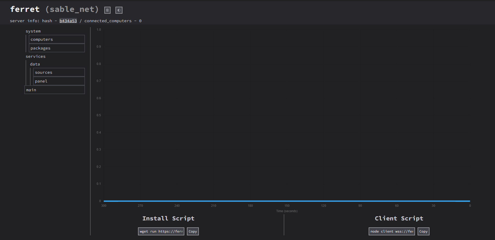

# Getting started with ferret

To start using ferret, you will need access to a running instance of the server, ([source](https://github.com/ferretsys/Ferret))

Once you have your token, and you have signed in, you will be brought to a main panel page looking something like this:

::: warning
Be careful with installing onto computers with data, as install deletes all files
:::
Once you run the install script on a computer it will show up in the computers tab
